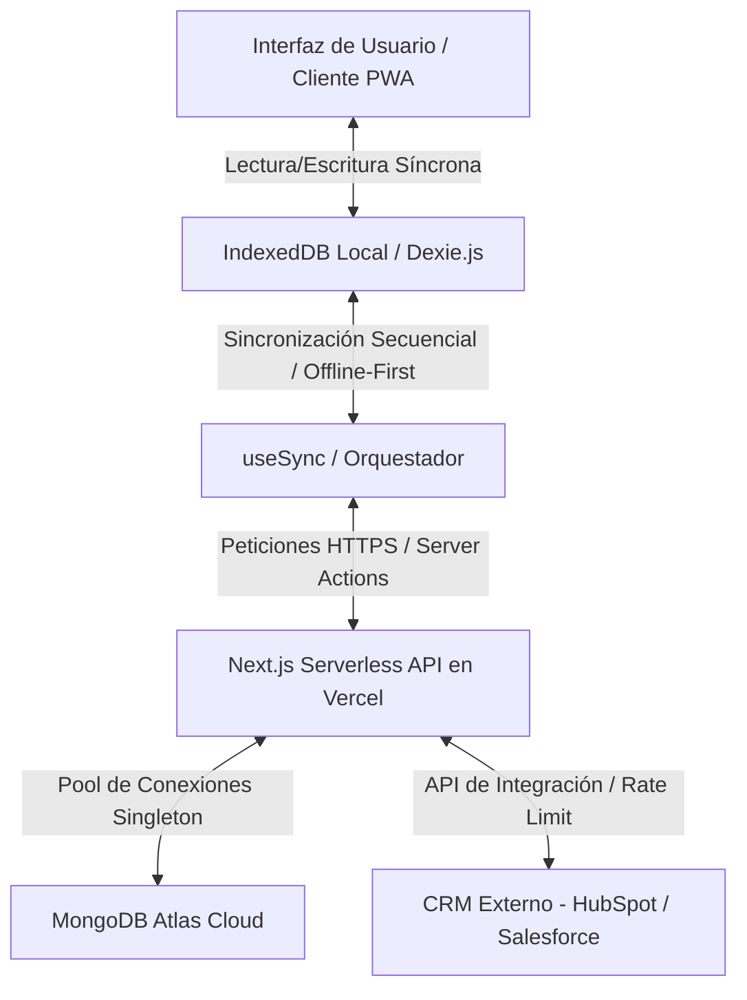

# Guía de Despliegue en Producción: Next.js 14 PWA & MongoDB Atlas

Este documento detalla el proceso para desplegar la aplicación en producción de manera segura, escalable y con soporte resiliente de red (Offline-First). Dado el carácter educativo de este proyecto, se incluyen justificaciones arquitectónicas detalladas de cada paso.

---

## 1. Arquitectura de Datos en Producción

En producción, el flujo de datos opera en dos niveles para garantizar que la aplicación responda instantáneamente al usuario incluso sin conexión:



### Principios para Producción:
*   **Cliente Desacoplado:** El cliente nunca espera al servidor para operaciones de escritura o lectura habituales.
*   **Base de Datos Intermedia Activa:** MongoDB sirve como almacén intermedio seguro para validar, encolar y procesar cambios antes de enviarlos al CRM externo, protegiendo las cuotas de API de este último.

---

## 2. Configuración Segura de MongoDB Atlas (Vercel Integration)

El despliegue de una base de datos en la nube para aplicaciones serverless presenta un desafío de red: las funciones en Vercel se ejecutan sobre IPs dinámicas y efímeras. No tienen una IP estática fija de salida.

> [!CAUTION]
> **NUNCA configures la lista blanca de IPs de MongoDB Atlas como pública (`0.0.0.0/0`) en producción.** Esto permite que cualquiera intente atacar tu base de datos por fuerza bruta.

### Solución: Integración Oficial de Vercel y MongoDB Atlas
La forma recomendada y segura de conectar ambos servicios sin comprometer la seguridad de red es utilizar la integración oficial de MongoDB:

1.  Ve al dashboard de tu proyecto en **Vercel**.
2.  Accede a la pestaña **Integrations**.
3.  Busca **MongoDB Atlas** e instala la integración.
4.  Durante la instalación, el asistente te pedirá iniciar sesión en tu cuenta de MongoDB Atlas y seleccionar el proyecto/clúster correspondiente.
5.  La integración configura automáticamente:
    *   La lista blanca de IPs dinámicas de Vercel en MongoDB Atlas a través de APIs internas de red del proveedor cloud.
    *   La variable de entorno `MONGODB_URI` en tu proyecto de Vercel con la cadena de conexión correspondiente.

---

## 3. Variables de Entorno en Vercel

Debes definir las siguientes variables de entorno en el panel de configuración de tu proyecto en Vercel (**Project Settings -> Environment Variables**):

| Variable | Descripción | Valor Recomendado |
| :--- | :--- | :--- |
| `MONGODB_URI` | Cadena de conexión a tu base de datos MongoDB Atlas. | Inyectada por la integración de Vercel o de formato `mongodb+srv://<usuario>:<password>@<cluster>.mongodb.net/<base-datos>?retryWrites=true&w=majority` |
| `NEXTAUTH_SECRET` | Clave secreta para firmar y cifrar los tokens JWT de sesión. | Genera una cadena aleatoria de 32 bytes (ver sección siguiente). |
| `NEXTAUTH_URL` | URL base de tu aplicación web en producción. | `https://tu-aplicacion.vercel.app` |

### Generación de `NEXTAUTH_SECRET` en producción:
Ejecuta el siguiente comando en tu consola local para generar una clave criptográficamente segura:
```bash
openssl rand -base64 32
```
* **Explicación del comando:** `openssl` es una biblioteca criptográfica estándar. El subcomando `rand` genera bytes aleatorios utilizando un generador de números pseudoaleatorios seguro para criptografía. El flag `-base64` codifica la salida en formato Base64 para que sea seguro copiarla como texto en las variables de entorno.

---

## 4. Reutilización de Conexiones Serverless (Mongoose Singleton)

En entornos de hosting tradicionales (como VPS o contenedores dedicados), una aplicación mantiene una conexión persistente y única a la base de datos que se reutiliza a lo largo del tiempo. 
Sin embargo, en **Vercel (Arquitectura Serverless)**:
1.  Cada petición HTTP puede levantar una nueva instancia aislada de una función Lambda.
2.  Si inicializas una conexión a MongoDB en cada petición sin control, agotarás el pool de conexiones de Atlas en pocos segundos bajo tráfico moderado.

Para evitar esto, en [mongodb.ts](file:///C:/Users/sergi/Documents/Proyectos/nextjs-pwa/src/lib/mongodb.ts) implementamos un patrón Singleton utilizando el objeto `global` de Node.js:

```typescript
// src/lib/mongodb.ts
import mongoose from 'mongoose';

const MONGODB_URI = process.env.MONGODB_URI;

if (!MONGODB_URI) {
  throw new Error('Por favor define la variable de entorno MONGODB_URI');
}

// Mantener la conexión en caché entre invocaciones serverless en el scope global
let cached = (global as any).mongoose;

if (!cached) {
  cached = (global as any).mongoose = { conn: null, promise: null };
}

async function dbConnect() {
  if (cached.conn) {
    return cached.conn; // Reutiliza la conexión activa si la función Lambda sigue caliente (warm start)
  }

  if (!cached.promise) {
    const opts = {
      bufferCommands: false,
      // Deshabilitar fallas lentas de red cuando no hay internet
      serverSelectionTimeoutMS: 5000, 
    };

    cached.promise = mongoose.connect(MONGODB_URI!, opts).then((mongooseInstance) => {
      return mongooseInstance;
    });
  }

  try {
    cached.conn = await cached.promise;
  } catch (e) {
    cached.promise = null;
    throw e;
  }

  return cached.conn;
}

export default dbConnect;
```

---

## 5. Prevención de Service Worker Atascado (Headers de Caché)

Uno de los problemas más comunes en la puesta en producción de PWAs es el **Service Worker Atascado (Stuck Service Worker)**. Si el navegador almacena en caché el archivo `sw.js` (el script del Service Worker) de forma indefinida, nunca detectará actualizaciones del código ni de la estrategia de caché local, dejando a los usuarios con una versión vieja de la app para siempre.

### Solución: Encabezados de Control de Caché
Es imprescindible servir el archivo del Service Worker indicándole al navegador que lo revalide en cada petición. 

En Next.js configuramos las cabeceras HTTP en `next.config.mjs` para garantizar que el archivo del Service Worker tenga un tiempo de vida (TTL) de cero y requiera validación explícita:

```javascript
// next.config.mjs
const nextConfig = {
  // ... resto de tu configuración
  async headers() {
    return [
      {
        source: '/sw.js',
        headers: [
          {
            key: 'Cache-Control',
            value: 'public, max-age=0, must-revalidate',
          },
        ],
      },
    ];
  },
};
```
*   `public`: Permite que la respuesta sea almacenada en caché por navegadores y proxies intermedios (como CDNs).
*   `max-age=0`: Indica al navegador que el recurso se considera inmediatamente obsoleto y debe ser revalidado.
*   `must-revalidate`: Obliga al navegador a realizar una petición de red (usando ETags o modificadores de fecha) antes de servir la copia en caché local, garantizando que el usuario obtenga inmediatamente la nueva versión del Service Worker si se sube a producción.

---

## 6. Verificación de Producción

Una vez desplegada tu aplicación en Vercel, sigue este checklist de verificación utilizando las herramientas de desarrollador (**F12 -> DevTools**):

1.  **Registro Exitoso del Service Worker:**
    *   Ve a la pestaña **Application -> Service Workers**.
    *   Verifica que la URL del SW sea la correcta y que muestre el estado en verde: `activated and is running`.
2.  **Persistencia de Sesión Offline:**
    *   Inicia sesión con tu usuario de prueba.
    *   Activa el modo **Offline** en la pestaña *Network* o *Service Workers*.
    *   Recarga la página. La sesión debe mantenerse activa (gracias al caché `StaleWhileRevalidate` configurado para `/api/auth/session`).
3.  **Funcionamiento de Offline Fallback:**
    *   Manteniendo el modo offline, navega a una ruta que no esté pre-cacheada (o intenta acceder a una página que no exista).
    *   Debería cargarse la página de fallback offline amigable (`/~offline`) en lugar del clásico dinosaurio del navegador.
4.  **IndexedDB (Dexie.js):**
    *   Ve a **Application -> IndexedDB -> db_tasks**.
    *   Verifica que al realizar operaciones de inserción offline las tareas se almacenen con `synced: 0`.
    *   Desactiva el modo offline y verifica que tras unos segundos se sincronicen con MongoDB Atlas (cambiando `synced: 1`) de forma secuencial y sin duplicar registros.
