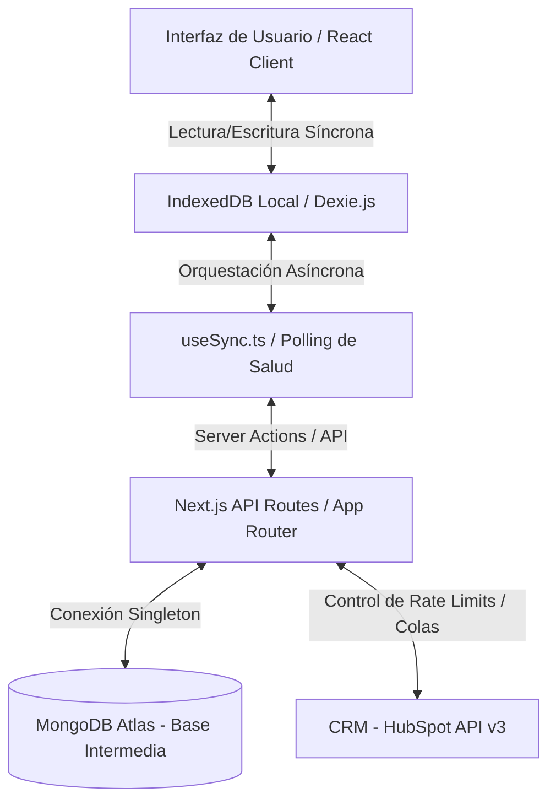

# PWA CRM Dashboard (Offline-First con Sincronización a HubSpot)

Este proyecto es una Aplicación Web Progresiva (PWA) de nivel empresarial diseñada para gestionar leads (contactos y empresas) en movilidad y bajo condiciones inestables de red. Utiliza una arquitectura **Offline-First**, donde el navegador almacena localmente todos los cambios en IndexedDB y los sincroniza de forma segura y ordenada con una base de datos intermedia (MongoDB Atlas) y un CRM externo (HubSpot) al recuperar la conexión.

---

## 1. Arquitectura de Datos y Sincronización

La aplicación sigue estrictamente un flujo desacoplado para garantizar que la interfaz responda al usuario en milisegundos sin depender de la latencia de la red:



### Principios de Diseño:
*   **Fuente Única de Verdad (SSOT):** La interfaz visual (`/`) lee y escribe datos exclusivamente de la IndexedDB local (Dexie.js). Esto garantiza disponibilidad del 100% en modo fuera de línea.
*   **Base de Datos Intermedia:** MongoDB actúa como amortiguador. Encola y valida las modificaciones locales del usuario antes de enviarlas al CRM externo para evitar duplicados y proteger los límites de tarifa (*rate limiting*) de HubSpot.
*   **Resiliencia Automática:** El hook `useSync` realiza un test ligero a `/api/health`. Si la red falla, detiene la sincronización e inicia un intervalo de reintento automático. En cuanto el servidor vuelve a responder, sincroniza en segundo plano sin requerir que el usuario recargue (F5).

---

## 2. Stack Tecnológico y Dependencias Core

### Frontend & PWA:
*   **Next.js 14 (App Router):** Estructura de rutas y optimización de renderizado.
*   **Tailwind CSS:** Diseño premium con gradientes, efectos de desenfoque de fondo y soporte adaptable.
*   **Dexie.js & Dexie React Hooks:** Abstracción reactiva y tipada sobre IndexedDB.
*   **TanStack Query (React Query):** Caché de datos configurada para PWAs (`retry: 0`, `staleTime: Infinity`).
*   **Next-PWA (Workbox):** Compilación y generación de caché estática en el Service Worker (`sw.js`).
*   **Lucide React:** Set de iconos limpios y modernos.

### Backend & Autenticación:
*   **Mongoose (MongoDB Client):** Conexión segura y esquemas de datos intermedios.
*   **NextAuth.js (Auth.js):** Gestión de sesiones segura en el cliente y servidor.
*   **Bcryptjs:** Encriptación y almacenamiento seguro de contraseñas de usuarios.

### Testing:
*   **Playwright Test:** Suite de pruebas automatizadas E2E que simula la transición Offline/Online mediante el control de red del navegador y valida que IndexedDB y MongoDB sincronicen secuencialmente sin pérdida de datos.

---

## 3. Preparación del Entorno Local

### Requisitos Previos:
*   Node.js 18 o superior.
*   Una instancia de MongoDB (local o en la nube Atlas).
*   Cuenta de desarrollador de HubSpot (Opcional, si deseas probar sincronización real).

### Configuración del archivo `.env.local`
Crea un archivo `.env.local` en la raíz del proyecto basándote en la plantilla `.env.template`:

```env
# Conexión a MongoDB (Usa local o Atlas)
MONGODB_URI="mongodb://localhost:27017/dashboard-pwa"

# NextAuth Configuración (Genera una clave con: openssl rand -base64 32)
NEXTAUTH_URL="http://localhost:3000"
NEXTAUTH_SECRET="tu_clave_secreta_aqui"

# CRM Provider ("mock" para pruebas sin red o "hubspot" para real)
CRM_PROVIDER="hubspot"
HUBSPOT_ACCESS_TOKEN="pat-tu-access-token-de-hubspot"
```

---

## 4. Comandos de Desarrollo y Ejecución

1.  **Instalar dependencias:**
    ```bash
    npm install
    ```
2.  **Distribuir iconos premium de la PWA y remover favicon por defecto:**
    ```bash
    node copy-icons.js
    ```
3.  **Correr en modo desarrollo (Hot Reloading):**
    ```bash
    npm run dev
    ```
4.  **Compilar y probar versión de producción (Pruebas del Service Worker):**
    ```bash
    npm run build
    npm start
    ```

---

## 5. Pruebas E2E de Sincronización (Playwright)

El proyecto cuenta con pruebas automáticas robustas que simulan cortes de internet e inyecciones de datos en IndexedDB.

1.  **Instalar los navegadores de Playwright:**
    ```bash
    npx playwright install chromium
    ```
2.  **Correr las pruebas automatizadas en modo headless (segundo plano):**
    ```bash
    npx playwright test
    ```
3.  **Correr en modo interactivo (Interfaz de usuario para ver las simulaciones offline):**
    ```bash
    npx playwright test --ui
    ```

---

## 6. Despliegue en Producción (Vercel)

El despliegue de una PWA offline-first en entornos Serverless requiere configuraciones específicas que ya vienen listas en el proyecto:

### A. Integración de Base de Datos
*   Para conectar tu aplicación de **Vercel** con **MongoDB Atlas** de forma segura, instala la integración oficial en tu dashboard de Vercel. Esto evitará tener que abrir la lista blanca de IPs (`0.0.0.0/0`) en MongoDB Atlas, manteniendo tu clúster protegido.

### B. Headers de Caché para el Service Worker
Para evitar el error de **Service Worker Atascado** (donde los usuarios se quedan con una versión vieja de la app para siempre), en `next.config.mjs` se inyectan las siguientes cabeceras al archivo `sw.js`:
*   `Cache-Control: public, max-age=0, must-revalidate`
Esto obliga al navegador a validar en cada visita si existe una nueva versión del Service Worker en el servidor antes de servir la copia local.
